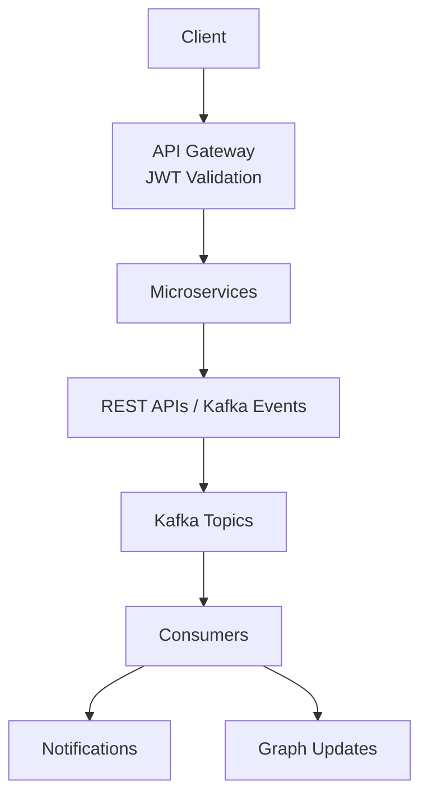

# LinkedIn-Like Scalable Backend Using Microservices Architecture

## Overview
The platform supports core social networking functionalities, including:

* 👤 User management and authentication
* 📝 Post creation and engagement (likes)
* 🤝 Connection management using graph-based relationships
* 🔔 Event-driven notifications powered by asynchronous messaging
* 🌐 API Gateway for centralized routing and request handling

The system is designed with scalability, loose coupling, and fault tolerance in mind.

## 🏗️ System Architecture

### 🔹 Microservices
* User Service – Handles users & authentication (JWT generation)
* Post Service – Manages posts and likes
* Connection Service – Graph-based relationships (Neo4j)
* Notification Service – Kafka-based event processing
* API Gateway – Centralized routing & authentication
* Discovery Server (Eureka) – Service registration


## 🔐 Authentication & Security

JWT-based authentication with token generation in User Service and validation at API Gateway.

### Gateway Responsibilities

* ✅ Validate JWT Tokens
* ✅ Extract User Context
* ✅ Forward Secure Requests
* ✅ Enforce Access Control

### Benefits

* 🔒 Centralized Security
* 🚀 Stateless Architecture
* 📈 Better Scalability
* 🧩 Reduced Service Complexity


## ⚡ Event Streaming with Apache Kafka

### 📌 Kafka Topics

| Topic                     | Description                                                      |
| ------------------------- | ---------------------------------------------------------------- |
| `post-create-topic`       | Published when a user creates a post                             |
| `post-like-topic`         | Published when a user likes a post                               |
| `connection-sent-topic`   | Published when a connection request is sent                      |
| `connection-accept-topic` | Published when a connection request is accepted                  |
| `user-create-topic`       | Published when a new user is created and synchronized with Neo4j |

### 📥 Event Consumers

**Notification Service**

* Consumes user activity events
* Generates and delivers notifications for posts, likes, and connection activities

**Connection Service**

* Consumes user and connection events
* Updates graph relationships in Neo4j
* Maintains the professional network structure

### ⚙️ Kafka Configuration

* **Partitions:** 3
* **Replication Factor:** 1
* **Producer Acknowledgements:** Enabled
* **Asynchronous Event Processing:** Supported across all services


## 🔄 Service Communication

### Communication Patterns

* ✅ OpenFeign for Inter-Service Communication
* ✅ REST-based Synchronous Requests
* ✅ Kafka-based Asynchronous Messaging

### Benefits

* ⚡ Loose Coupling Between Services
* 🚀 Improved Scalability
* 📨 Reliable Event Delivery
* 🔄 Flexible Communication Patterns

## 🗄️ Data Layer

### Storage Technologies

* ✅ PostgreSQL — User Profiles, Posts
* ✅ Neo4j — Connection Network and Relationship Graphs

### Why Neo4j?

* 🔗 Relationship-Centric Data Modeling
* ⚡ Fast Multi-Hop Connection Queries
* 🎯 Enables Future Recommendation Systems


## 🐳 Deployment

### Docker

* ✅ Containerized Each Service with Docker
* ✅ Multi-Container Setup using Docker Compose
* ✅ Integrated Services, Databases, and Kafka

### Kubernetes

* ✅ Deployments for Service Management
* ✅ Services for Internal Networking
* ✅ Ingress for External Routing
* ✅ Kafka and Kafbat Integration


## 🔄 System Flow



## ⚙️ Tech Stack

* ☕ Backend: Java, Spring Boot
* 🏗️ Architecture: Microservices
* 📨 Messaging: Apache Kafka
* 🗄️ Databases: PostgreSQL, Neo4j
* 🔐 Security: JWT Authentication
* 🔍 Service Discovery: Eureka Server
* 🐳 DevOps: Docker, Kubernetes

## 🚀 Running the Project

### 🐳 Docker

```bash
docker-compose up --build
```

### ☸️ Kubernetes

```bash
kubectl apply -f k8s/
```


## 🚧 Future Enhancements

* 🔒 Rate Limiting and Throttling at API Gateway
* ⚡ Redis Caching for Improved Performance
* 🔄 Kafka Retry Mechanism and Dead Letter Queues
* 📊 Monitoring and Metrics with Prometheus & Grafana
* 🚀 Automated CI/CD Deployment Pipeline
* 🔍 Distributed Tracing and Service Observability

## 👨‍💻 Author

Ranjit Kumar
